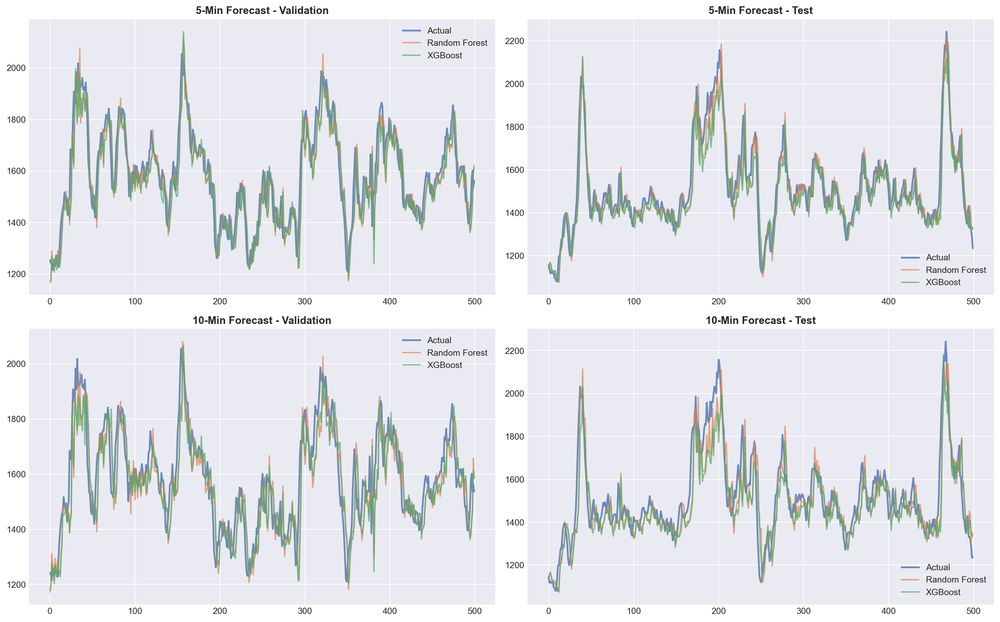
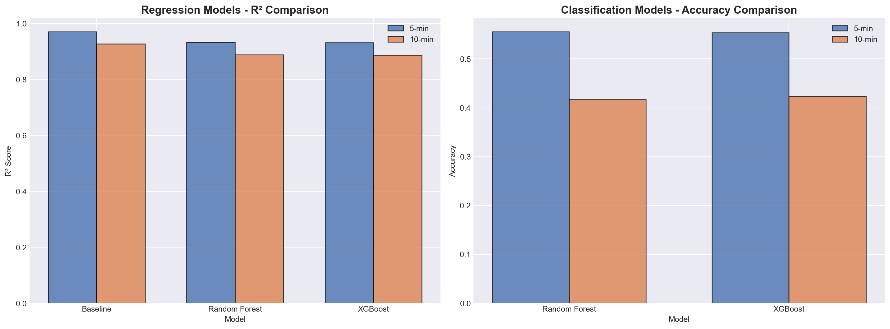
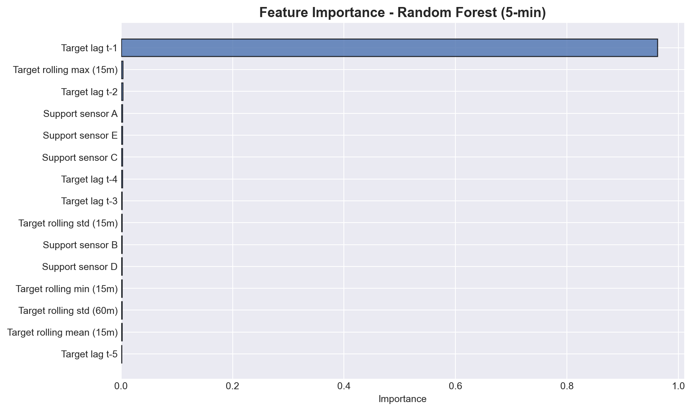

# Power Plant Sensor Forecasting Benchmark

Public-safe benchmark package for a short-horizon forecasting study on waste-to-energy plant telemetry.

This repository is intentionally structured to show the evaluation approach and the benchmark outcome **without exposing the raw private dataset schema**. The source CSV and original column headers are not included here.

## Project context

The original MVP explored whether plant sensor values could be forecast **5 to 10 minutes ahead** from historical telemetry sampled every **5 minutes**.

During review, the most important finding was not a model score. It was a target-selection failure:

- the highest-autocorrelation candidate was a sparse auxiliary fuel meter
- that signal was active in only a tiny fraction of rows
- the resulting trend labels collapsed and made the downstream classification task misleading

The benchmark was then rerun on a stronger non-sparse target: a continuous post-boiler acid-gas stack sensor.

## Dataset profile

- 50,388 rows
- 23 sensor columns
- 174 days of history
- no missing values
- fixed 5-minute cadence

## Main result

Short-horizon forecasting is feasible for the selected continuous sensor, but a one-step persistence baseline is already extremely strong.

### Regression results

| Horizon | Baseline R² | Random Forest R² | XGBoost R² | Baseline RMSE | Random Forest RMSE | XGBoost RMSE |
| --- | ---: | ---: | ---: | ---: | ---: | ---: |
| 5 min | 0.9707 | 0.9335 | 0.9326 | 44.48 | 67.04 | 67.51 |
| 10 min | 0.9274 | 0.8889 | 0.8878 | 70.15 | 86.78 | 87.19 |

### Classification results

| Horizon | Random Forest accuracy | XGBoost accuracy |
| --- | ---: | ---: |
| 5 min | 55.6% | 55.4% |
| 10 min | 41.7% | 42.3% |

## Interpretation

- the signal is forecastable
- the tree models are stable
- lag structure dominates the feature set
- persistence remains the strongest baseline at 5 to 10 minutes
- this benchmark is more useful as an evaluation framework than as a claim that ML has already beaten the plant

## Public-safe assets

The charts in [`assets/`](./assets) are masked versions of the figures used in the published case study.

### Selected figures







## Start with the notebook

The main entry point is:

- [`notebooks/power_plant_sensor_forecasting_public.ipynb`](./notebooks/power_plant_sensor_forecasting_public.ipynb)

It provides a clean workflow for:

- setting the private CSV path and private column names at runtime
- running the public-safe benchmark
- loading the sanitized summary back into the notebook

## Repository contents

- [`notebooks/power_plant_sensor_forecasting_public.ipynb`](./notebooks/power_plant_sensor_forecasting_public.ipynb)
  Notebook-first workflow for the benchmark.
- [`data/public-summary.json`](./data/public-summary.json)
  Sanitized benchmark summary used by the notebook.
- [`scripts/run_power_plant_forecasting.py`](./scripts/run_power_plant_forecasting.py)
  Public-safe evaluation runner. It accepts a private timestamp column and private target column at runtime so the raw schema does not need to live in this repo.
- [`assets/`](./assets)
  Masked figures exported from the benchmark run.

## Running the analysis privately

The raw dataset is not included. If you have authorized access to the original CSV, run:

```bash
python scripts/run_power_plant_forecasting.py \
  --data /path/to/private_dataset.csv \
  --timestamp-column "<private timestamp column>" \
  --target "<private target column>" \
  --public-safe \
  --output-dir ./artifacts
```

Use `--public-safe` to keep exported figures masked.

## Notes

- On macOS, XGBoost may require `libomp`.
- The benchmark is designed to make target-selection mistakes visible early, not to hide them behind optimistic metrics.
